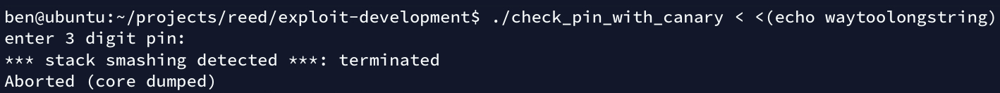

# exploit development

<!-- vim-markdown-toc GFM -->

* [theory](#theory)
  * [stack buffer overflows](#stack-buffer-overflows)
  * [return-oriented programming](#return-oriented-programming)
    * [return-to-libc](#return-to-libc)
    * [return-to-PLT](#return-to-plt)
* [countermeasures](#countermeasures)
  * [NX bit](#nx-bit)
  * [stack canaries](#stack-canaries)
  * [ASLR](#aslr)
  * [PIE](#pie)
* [sources and references](#sources-and-references)

<!-- vim-markdown-toc -->

# theory

## stack buffer overflows

## return-oriented programming

### return-to-libc

TODO write about bypassing the NX bit by jumping to the C standard library

### return-to-PLT

TODO write about bypassing ASLR by jumping to the Procedure Linkage Table

# countermeasures

This section covers exploit mitigation techniques and how to disable them to make writing
the first exploit easier. This should only be done in a VM. This section focuses on Linux and gcc.

## NX bit

NX stands for No eXecute. This technology tries to remedy the issue that the Von Neumann architecture
uses the same memory for instructions and data which can result in arbitrary code execution.

> architecture-von-neumann-issue.jpg

</img>

The NX bit allows marking specific segments as executable or not executable.
This prevents arbitrary code execution from the stack (by crashing the process).
It does not prevent return-to-libc attacks as the memory that contains
the C Standard library has to be executable.

---

To enable execution of instructions on the stack, gcc can be passed the `-z execstack` linker flag.

## stack canaries

Also known as stack cookies.

Provide stack smashing protection by pushing an additional value to the stack (on function calls).
On function return that value is checked and if it is incorrect it means the stack has been smashed.
In that case the program terminates with `SIGABRT` and warns about attempted stack smashing:

> stack-canary-triggered.jpg

</img>

---

By default this is disabled in gcc, but some distributions patch gcc to enable it.
To disable stack canaries pass the `-fno-stack-protector` flag to gcc.

## ASLR

Address Space Layout Randomization.

## PIE

Position Independent Executables.

# sources and references

* [re4b] Yurichev, D. (2013). Reverse Engineering for Beginners. https://beginners.re
* [pracbin] Andriesse, D., & Francisco, S. (2018). PRACTICAL BINARY ANALYSIS Build Your Own Linux Tools for Binary Instrumentation, Analysis, and Disassembly (2nd ed.). No Starch Press.
