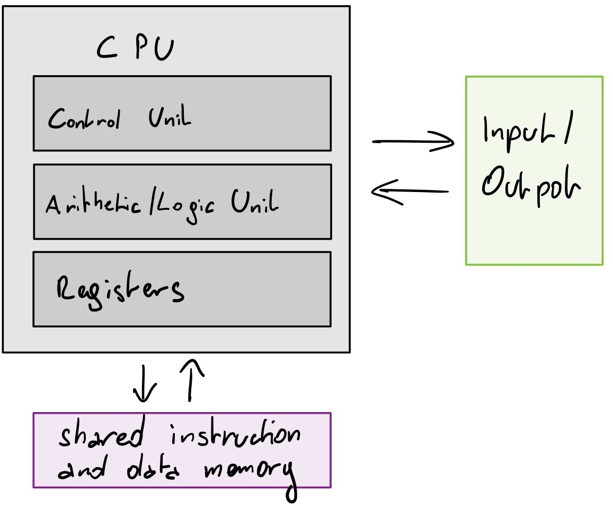

# exploits

<!-- vim-markdown-toc GFM -->

* [countermeasures](#countermeasures)
  * [NX bit](#nx-bit)
* [sources and references](#sources-and-references)

<!-- vim-markdown-toc -->

# countermeasures

This section covers countermeasures and how to disable them to make writing
the first exploit easier. This should only be done in a VM. This section
focuses on Linux.

## NX bit

NX stands for No eXecute. This technology tries to remedy the issue that the Von Neumann architecture
uses the same memory for instructions and data.

> architecture-von-neumann.jpg

</img>

# sources and references

* [re4b] Yurichev, D. (2013). Reverse Engineering for Beginners. https://beginners.re
* [pracbin] Andriesse, D., & Francisco, S. (2018). PRACTICAL BINARY ANALYSIS Build Your Own Linux Tools for Binary Instrumentation, Analysis, and Disassembly (2nd ed.). No Starch Press.
