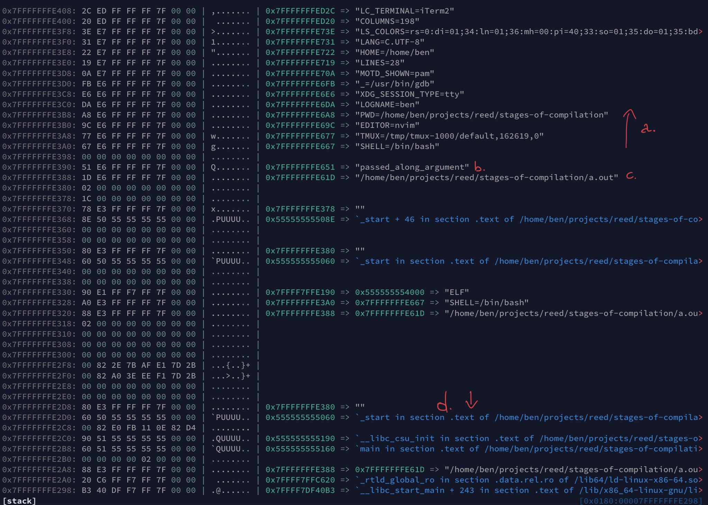

# gdb

## configuration

GDB looks for a local configuration file under `~/.gdbinit`. Here's a minimal example:

```sh
# Use intel syntax for assembly instead of the default AT&T one:
set disassembly-flavor intel
```

It uses the same syntax as the `set` command inside GDB.<br>
For a full list of settings and explanations run `help set` in GDB.

---

Unfortunately there's no option to remove the wall of text when starting up GDB.<br>
You can create an alias to achieve the same though:

```sh
# .bashrc, .zshrc or similar.
alias gdb="gdb -q"
```

## plugins

GDB on its own is great, if not very pretty and user-friendly for novices.
The following are two plugins that extend its functionality while
adding a couple of very useful features that will make your life easier.

Both plugins are highly customizable.

### Voltron

* [github.com/snare/voltron](https://github.com/snare/voltron)

Provides "views" into certain aspects of the debugger (not just GDB). My favorite two are:

* Registers
* The Stack

Changes since the last instruction are color coded and you can quickly scroll through the stack.<br>
Voltron views can be displayed in any TTY but they really shine when you use them in tmux (or screen).

Here's an example from the main readme:

> stack-dump-main.jpg

</img>

### GEF

**GDB Enhanced Features**

* [github.com/hugsy/gef](https://github.com/hugsy/gefv)
* [GEF documentation](http://gef.rtfd.io/)

# sources and further reading

