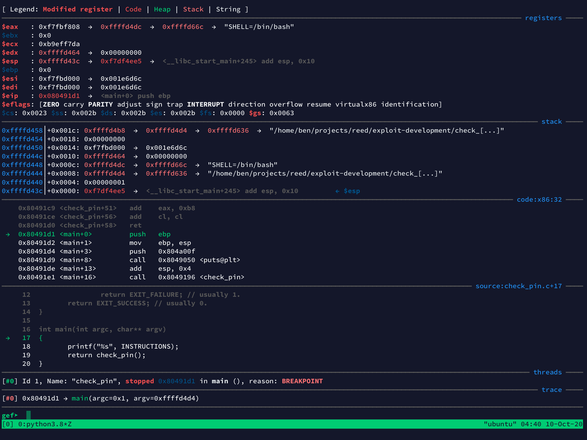

# GDB

# toc

<!-- vim-markdown-toc GFM -->

* [the basics](#the-basics)
* [configuration](#configuration)
* [plugins](#plugins)
  * [Voltron](#voltron)
  * [GEF](#gef)
* [sources and further reading](#sources-and-further-reading)

<!-- vim-markdown-toc -->

# the basics

TODO write short tutorial

* `i b` list breakpoints
* `d 1` remove first breakpoint
* `b *main`
* `r` run
* `p $rip+0xe9c`
* `x $rip+0xe9c`
* `ct` (gef) after ctrl-l
* `fin` run until return
* `n` step over (don't descend into functions)
* `$ 0x80` evaluate expression
* `checksec`
* `x/a $rsp` get current stack pointer addr.
* `bt 2` last 2 stack frames (stack 2 -> neuer rip)

# configuration

GDB looks for a local configuration file under `~/.gdbinit`. Here's a minimal example:

```sh
# Use intel syntax for assembly instead of the default AT&T one:
set disassembly-flavor intel
```

It uses the same syntax as the `set` command inside GDB.<br>
For a full list of settings and explanations run `help set` in GDB.

---

Unfortunately there's no option to remove the wall of text when starting up GDB.<br>
You can create an alias to achieve the same though:

```sh
# .bashrc, .zshrc or similar.
alias gdb="gdb -q"
```

# plugins

GDB on its own is great, if not very pretty and user-friendly for novices.
The following are two plugins that extend its functionality while
adding a couple of very useful features that will make your life easier.

Both plugins are highly customizable.

## Voltron

* [github.com/snare/voltron](https://github.com/snare/voltron)

Voltron provides "views" into certain aspects of the debugger (not just GDB). My favorite is the stack view.
You can quickly scroll through the memory near the current frame (both ways).

Voltron views can be displayed in any TTY but they really shine when you use them in tmux (or screen).<br>
This is an example of running Voltron in a tmux split under GEF:

> voltron.jpg<br>

</img>

## GEF

**GDB Enhanced Features**

* [github.com/hugsy/gef](https://github.com/hugsy/gefv)
* [GEF documentation](http://gef.rtfd.io/)

This plugin is aimed at exploit developers and reverse-engineers. It extends GDB using the Python API (2/3),
so you need a reasonably recent version of GDB (>=7). It adds more than 50 commands but even if you stick
to the default GDB set it is extremely useful by presenting you with a summary `context` after each command
that saves you a lot of typing.

Any changes in registers or memory since the last instruction are color coded.

> gdb-gef.jpg

</img>


# sources and further reading

