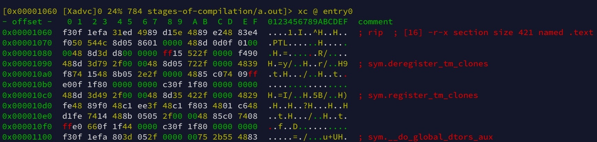
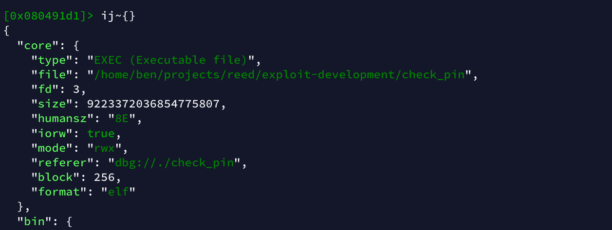
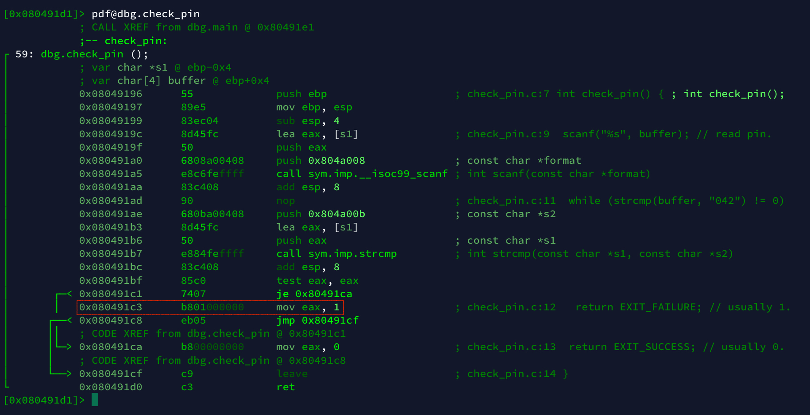

# Radare2

Radare (RawDataRecovery) was started as a forensic hex editor.
Over the years it has evolved into a reverse-engineering and
binary analysis framework. Radare2 is a complete rewrite.

It is (somewhat unfairly) known for its difficulty curve, but once you get used to
how it does things, it's hard to go back.

# toc

<!-- vim-markdown-toc GFM -->

* [installation](#installation)
* [the basics](#the-basics)
* [`r2`](#r2)
  * [the grammar of commands](#the-grammar-of-commands)
  * [common commands](#common-commands)
  * [visual mode shortcuts](#visual-mode-shortcuts)
* [usage examples](#usage-examples)
  * [patching a binary](#patching-a-binary)
* [scripting with `r2pipe`](#scripting-with-r2pipe)
* [configuration](#configuration)
* [GUIs](#guis)
* [sources and further reading](#sources-and-further-reading)

<!-- vim-markdown-toc -->

# installation

You are strongly encouraged to always use the absolute latest version of Radare2
(it is a requirement to get any support). <br>
As such, the best way to install it is directly from the [git repo](https://github.com/radareorg/radare2):

```sh
git clone https://github.com/radareorg/radare2.git
radare2/sys/install.sh # also used to update.
```

You might want to compare your version (`r2 -v`) to the latest commit.

# the basics

See [[r2b]](#sources-and-further-reading).

Radare2 follows the Unix philosophy of minimalist, modular programs.
The provided command line utilities are:

| tool name     | function                                           |
| ---           | ---                                                |
| **`radare2`** | the main tool (CLI/TUI), aliased to `r2`           |
| `pr2pm`       | the r2 package manager                             |
| `rabin2`      | extracts info about a binary (ELF, PE, etc.)       |
| `radiff2`     | binary diffing, a more powerful `cmp`              |
| `rafind2`     | finds byte patterns                                |
| `ragg2`       | compiler that creates tiny binaries for injection  |
| `rahash2`     | block based hashing (great to compare large files) |
| `rarun2`      | run programs in different environments             |
| `rasm2`       | CLI assembler/disassembler (x86, x64, Java, etc.)  |
| `rax2`        | base/radix/ASCII/string converter                  |

Radare2 can open many input/output sources as if they were files. Among others:<br>
disks, files, kernel drivers, network connections, partitions, processes.

# `r2`

`r2` supports different **modes of operation**. You can think of it a
bit like the Vim of reverse engineering tools.

You start in **command mode** (CLI). Execute the `?` command to get help.
From command mode you can switch to **visual mode** (TUI) with
the `V` command. In visual mode you can cycle through various
print modes with the shortcuts `p` (next) and `P` (previous).

| mode               | function                                  |
| ---                | ---                                       |
| command mode       | default mode, all commands available      |
| visual mode: hex   | hex editor view (similar to `xxd`)        |
| visual mode: disas | disassembly view                          |
| visual mode: debug | disassembly view with registers and stack |
| visual mode: word  |                                           |
| visual mode: buf   |                                           |
| visual-panels mode | advanced, panel based TUI                 |
| visual graph mode  | control flow diagrams akin to IDA pro     |

You will have noticed that in visual mode you use keyboard shortcuts.
Press `??` to get the full list.
You can still execute commands with `:` though, just like in Vim.
You can continue to execute commands or close the prompt with `ctrl-d`
or by sending an empty line.

The shortcut `q` gets you back to command mode.<br>
The command `q` exits Radare2. You can also use `ctrl-d` both times.

---

> r2-command-mode.jpg

</img>

* *note the following:*
  * in command mode the prompt shows the current position in the file
    * this position is the currently `seek`ed-to line (not the instruction pointer)
    * most commands operate on this address

---

> r2-visual-mode-hex.jpg

</img>

* *note the following:*
  * in visual mode you can see the current position in the top line (far left)
    * it is also the top line in the hex-dump
  * the instruction pointer is declared via a comment (`; rip`)

---

To open a file for analysis run `r2 /path/to/bin`. If you plan on modifying it add the
`-w` flag, if you would like to open the file in debug mode (to step through it) add `-d`.

## the grammar of commands

Modes are not the only similarity to Vim.
Just like it, Radare2 uses the chaining of single characters to create commands.

Each command starts with a **single mnemonic character**.<br>
For instance: every command that is related to some kind of analysis starts with `a`.

You can use the single character as a command directly or append more characters and symbols
to get access to more functionality in the corresponding category. A single `a`, for example,
is aliased to `aai`, which stands for '**a**nalysis **a**ll **i**nfo' which shows info of all analysis paramters.

The full list can be seen with the `?` command, here is a short excerpt:

| first character | mnemonic     | as direct command                                              |
| ---             | ---          | ---                                                            |
| `a`             | **a**nalysis | aliased to `aai`                                               |
| `d`             | **d**ebugger | aliased to `d?`                                                |
| `i`             | **i**nfo     | show info of current file                                      |
| `o`             | **o**pen     | list open file/open file (with parameter)                      |
| `p`             | **p**rint    | aliased to `p?`                                                |
| `s`             | **s**eek     | print current address/seek to address (with parameter)         |
| `w`             | **w**rite    | aliased to `w?`                                                |
| `V`             | **V**isual   | start visual mode                                              |

To learn more about the direct command and sub commands
you can append a `?` to get detailed help.

---

**Numbers** can also be used to modify how certain commands behave:

* `px` **p**rints a he**x**dump of a couple of Bytes
* `2px` executes it twice
* `px2` prints exactly 2 Bytes

---

Most commands are targeted at the position you are currently seeked to.
It can be inconvenient to seek to a new address just because you need to run a
single command there. This is were **temporary seeking** with `@` comes into play.

As an example:

* you are seeked to somewhere in the middle of a file
* you would like to print 512 Bytes from the start of that file

You can simply run `px512@0x0` which allows you to get the result and not change your current position.

---

A postfix worth mentioning is `j` that formats output as **JSON**.
`i` produces information for the currently open file, such as
the binary format. Using `ij` you get the same information as
a JSON array.

By appending a format modifier you can even pretty print it `ij~{}`:

> r2-json.jpg

</img>

To learn more about format modifiers (and the built-in `grep` that powers them) take a look at `~?`.

---

Finally, output can be **piped** directly to another program!<br>
Using the JSON example from above let's open the output in Vim: `ij~{}|vim - +"set ft=json"`.


## common commands

These should get you started.

* `?`, get help
* `aa`,  analyze all flags starting with `sym.` and `entry0` (you can add more `a`s for additional analysis)
* `afl`, list all functions
* `ie`, info about entrypoints
* `ii`, info about imports
* `il`, info about libraries
* `iS`, info about sections
* `s main`, seek to `main()`
* `db main`, set breakpoint at `main()`
* `dc`, continue execution
* `doo` or `ood`, reopen binary in debug mode (restart it)
* `pdf`, print disassembly of current (seeked-to) function
* `Vpp`, enter visual mode in hex view
* `V!`, enter visual-panels mode
* `VV`, enter graph mode
* `q!`, force quit without questions

## visual mode shortcuts

Shortcuts are executed immediately and don't require an enter. Here's a selection:

* `?` get help
* `h`, `j`, `k`, `l`, seek left/down/up/right (Vim-like navigation)
* `c` toggle cursor, navigate as above
* `n` and `N`, seek to next/previous function
* `.` seek to instruction pointer
* `s` and `S`, step into or step over
* `p` and `P`, switch trough print modes (next and previous)
* `!`, toggle visual-panels mode
* `V`, switch through graph modes
* `q`, quit

# usage examples

## patching a binary

Let's patch the `check_pin` binary from the [exploit-development ↣](../exploit-development#check_pin-source)
section so that it always returns `EXIT_SUCCESS`, even if we provide a wrong pin to it.

```sh
cp check_pin check_pin_cracked # make a backup.
r2 -w check_pin_cracked # open binary in write mode.

# r2
aa # analyse binary.
afl # get a list of functions.
s main # seek to main().

Vpp # open visual mode (debug view).
# look at main() and see that it calls check_pin().
:s dbg.check_pin # seek to it.
/test # look for a test instruction.

# decide how to patch the program.
:s 0x80491c3 # seek to: mov eax, 1 # sets return value to 1 for wrong pins.
:wa mov eax, 0 # change instruction to set eax to 0 -> return success.

# exit r2 and test binary with wrong pin:
./check_pin_cracked < <(123); echo $?

# returns 0 despite wrong pin!
```

> r2-check_pin-pre-patch.jpg

</img>

* *note the following:*
  * the line that will be patched by the process above is highlighted (pre-patch state)

# scripting with `r2pipe`

# configuration

Configuration in `r2` happens with the `e`-family of commands.

Use `ev` to learn about all options and what they do.
Use `e? src.color` to only learn about the color mode option.

From within `r2` you can use the `ed` command to open the config file (`~/.radare2rc`) in your editor.

> `.radare2rc`

```sh
# use matrix color scheme:
eco matrix

# use 256 colors:
e src.color = 2
```

# GUIs

* web interface: `r2 -c=H --`
* Cutter ([cutter.re](https://cutter.re))
* about 5 that are abandoned by now

# sources and further reading

* [r2b] pancake, maijin, et al. (2020). The Official Radare2 Book. https://book.rada.re/
