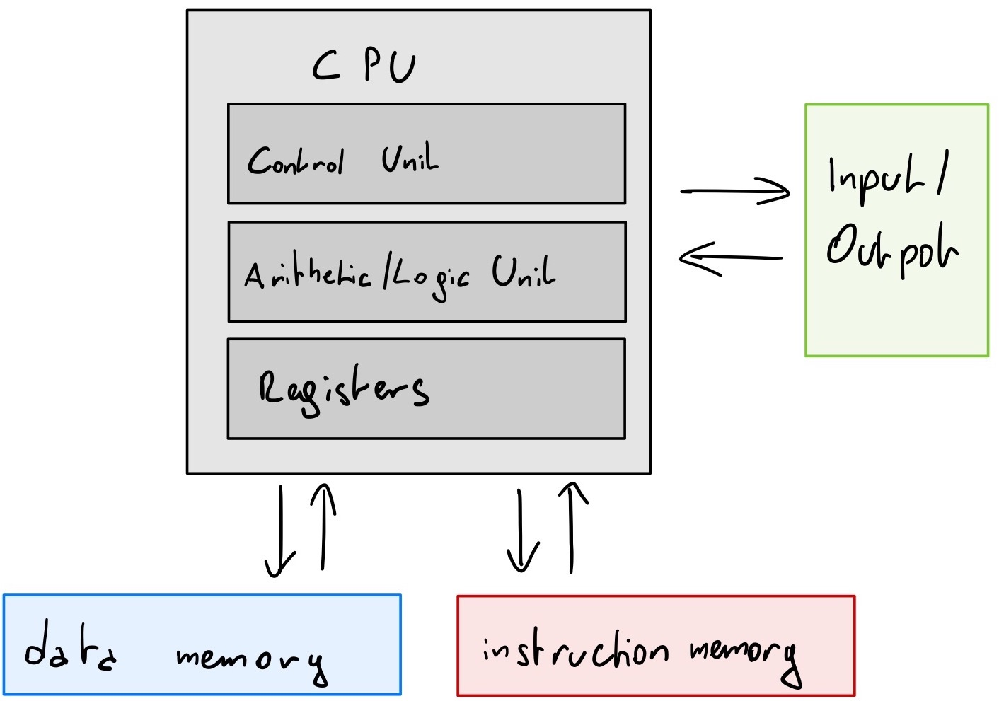
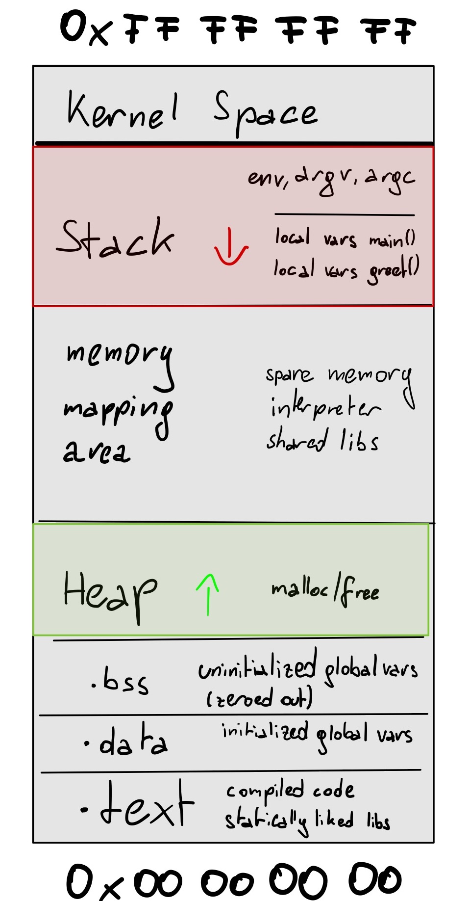

# RE🌾ED

notes about reverse engineering and exploit development


# toc

<!-- vim-markdown-toc GFM -->

* [computer architectures](#computer-architectures)
  * [Von Neumann](#von-neumann)
  * [Harvard](#harvard)
  * [modern processors](#modern-processors)
    * [consequences](#consequences)
* [memory](#memory)
  * [virtual memory](#virtual-memory)
  * [memory layout](#memory-layout)
  * [Bit and Byte order](#bit-and-byte-order)
  * [the stack](#the-stack)
  * [stack frames](#stack-frames)
* [stages of compilation](#stages-of-compilation)
  * [preprocessor](#preprocessor)
  * [compiler](#compiler)
  * [assembler](#assembler)
  * [linker](#linker)
* [instruction set architectures](#instruction-set-architectures)
  * [types](#types)
    * [CISC](#cisc)
    * [RISC](#risc)
  * [instruction sets](#instruction-sets)
    * [x86](#x86)
      * [AT&T and Intel syntax](#att-and-intel-syntax)
      * [x86_32](#x86_32)
      * [x86_64](#x86_64)
  * [ARM](#arm)
* [executable file formats](#executable-file-formats)
  * [ELF](#elf)
  * [Mach-O](#mach-o)
  * [PE](#pe)
* [binary analysis](#binary-analysis)
  * [static](#static)
  * [dynamic](#dynamic)
* [tools](#tools)
  * [GDB](#gdb)
  * [binutils](#binutils)
  * [Python 3](#python-3)
  * [Compiler Explorer](#compiler-explorer)
  * [binvis.io](#binvisio)
  * [dotfiles](#dotfiles)
* [exploits](#exploits)
* [sources and further reading](#sources-and-further-reading)

<!-- vim-markdown-toc -->

# computer architectures

The following two subsections show the minimal, archetypal representation of both architectures.
Caches (and for that matter cache levels) are ignored.

TODO source this section


## Von Neumann

See [[edvac]](#sources-and-further-reading).

Somewhat controversially named solely after John von Neumann this is still
the base for the most common CPU designs.

**architecture-von-neumann.jpg**

</img>

* *note the following:*
  * **data and instructions are stored in the same memory**
  * data and instructions are transported over the same bus

## Harvard

**architecture-harvard.jpg**

</img>

* *note the following:*
  * data memory and instruction memory are separated
  * they travel over separate buses

## modern processors

Most modern CPUs use the same memory for data and instructions, like
in the Von Neumann architecture.
To avoid the Von Neumann bottleneck multiple levels of caches are
added between CPU and memory (L1-Ln cache) and a seperate cache
for instructions and data ist used in the lowest level (similar to
the Harvard architecture).

The resulting architecture is called Modified Harvard or
to be more specific split-cache/**almost Von Neumann** architecture.

*As such modern CPUs are situated somewhere between a pure Von Neumann and a
pure Harvard architecture.*

### consequences

The - by the Von Neumann architecture - historically caused consolidation of data
(that can be freely written by the process)
and instructions (that are executed by the CPU)
in the same memory has led to countless memory corruption exploits and in
turn a myriad of countermeasures.

# memory

TODO source this section

## virtual memory

## memory layout

This section assumes an x86_32 Linux with a 1GiB/3GiB Kernel/userspace split.

**process-memory-layout.jpg**

</img>

* *note the following:*
  * high memory addresses are at the top (Intel convention)
  * the stack and heap both grow into free memory
  * the heap grows up
  * **the size of `argc`, `argv` and the environment influence where the stack starts!**
  * **the stack grows down!**
    * the more data is on the stack, the lower the last address
  * `0xFFFFFFFF` to `0xC0000000` is the kernelspace
  * `0xBFFFFFFF` to `0x00000000` is the userspace

## Bit and Byte order

See [[inteldev, vol. 1, ch. 1, p. 5f]](#sources-and-further-reading).

## the stack

## stack frames

# stages of compilation

See [[pracbin, p. 12ff]](#sources-and-further-reading).

This section assumes compilation for the x86_64 architecture on Linux.

All intermediary files can be found in the `stages-of-compilation` directory.

---

Let's go through the stages of compilation step by step.
We'll use the following example:

**stages.c**

```c
#include <stdio.h>
#include <stdlib.h>

#define FORMAT_STRING "%s"
#define MESSAGE "hello, world!\n"

void greet() {
  printf(FORMAT_STRING, MESSAGE);
}

int main(int argc, char** argv, char** envp)
{
  greet();
  return EXIT_SUCCESS;
}
```

* *note the following:*
  * using a `main()` signature with `envp` does not conform to POSIX but is widely supported by Unix-like systems and mentioned as a common alternative in the C standard ([[c11, Annex J.5.1, p. 575]](#sources-and-further-reading))


**run through all stages and save intermediary files**

```sh
uname -a
# Linux ubuntu 5.4.0-48-generic #52-Ubuntu SMP Thu Sep 10 10:58:49 UTC 2020 x86_64 x86_64 x86_64 GNU/Linux

gcc -masm=intel --save-temps stages.c

tree
# .
# ├── a.out
# ├── stages.c
# ├── stages.i
# ├── stages.o
# └── stages.s
```

---

**stages-of-compilation.jpg**

</img>

* *note the following:*
  * produced filenames assume compilation with `--save-temps`
  * on macOS gcc is llvm in disguise and will produce an additional `.bc` bitcode file

## preprocessor

In this first stage the preprocessor does the following:

* all included headers (`#include`) and our source file are (recursively) concatenated in place
* preprocessor macros (`#define`) are expanded

**stages.i** (partial)
```c
# 1 "stages.c"
# 1 "<built-in>"
# 1 "<command-line>"
# 31 "<command-line>"
# 1 "/usr/include/stdc-predef.h" 1 3 4

/* ... */

typedef signed char __int8_t;
typedef unsigned char __uint8_t;

/* ... */

extern FILE *stdin;
extern FILE *stdout;
extern FILE *stderr;

/* ... */

# 7 "stages.c"
void greet() {
  printf("%s", "hello, world!\n");
}

int main(int argc, char** argv, char** penv)
{
  greet();
  return 
# 14 "stages.c" 3 4
        0
# 14 "stages.c"
                    ;
}
```

* *note the following:*
  * our 15 line program ballooned to 1837 lines (`wc -l stages.i`)
    * all neccessary (uncompiled) code for the following stages  is now contained within
  * if you grep the file for include or define directives there won't be any (`egrep '#include|#define' stages.i`)
  * the `greet()` function no longer contains the macros for our strings but the strings themselves

## compiler

In the compilation stage our concatenated source is translated into assembly language.
Depending on flags more or less optimization takes place (`-O0` to `-O3`).

**stages.s (Intel syntax)**

```asm
	.file	"stages.c"
	.intel_syntax noprefix
	.text
	.section	.rodata
.LC0:
	.string	"hello, world!"
	.text
	.globl	greet
	.type	greet, @function
greet:
.LFB6:
	.cfi_startproc
	endbr64
	push	rbp
	.cfi_def_cfa_offset 16
	.cfi_offset 6, -16
	mov	rbp, rsp
	.cfi_def_cfa_register 6
	lea	rdi, .LC0[rip]
	call	puts@PLT
	nop
	pop	rbp
	.cfi_def_cfa 7, 8
	ret
	.cfi_endproc
.LFE6:
	.size	greet, .-greet
	.globl	main
	.type	main, @function
main:
.LFB7:
	.cfi_startproc
	endbr64
	push	rbp
	.cfi_def_cfa_offset 16
	.cfi_offset 6, -16
	mov	rbp, rsp
	.cfi_def_cfa_register 6
	sub	rsp, 32
	mov	DWORD PTR -4[rbp], edi
	mov	QWORD PTR -16[rbp], rsi
	mov	QWORD PTR -24[rbp], rdx
	mov	eax, 0
	call	greet
	mov	eax, 0
	leave
	.cfi_def_cfa 7, 8
	ret
	.cfi_endproc
.LFE7:
	.size	main, .-main
	.ident	"GCC: (Ubuntu 9.3.0-10ubuntu2) 9.3.0"
	.section	.note.GNU-stack,"",@progbits
	.section	.note.gnu.property,"a"
	.align 8
	.long	 1f - 0f
	.long	 4f - 1f
	.long	 5
0:
	.string	 "GNU"
1:
	.align 8
	.long	 0xc0000002
	.long	 3f - 2f
2:
	.long	 0x3
3:
	.align 8
4:

```

* *note the following:*
  * if not told otherwise (with `-masm=intel`) gcc creates assembly with AT&T syntax
  * constants and variables have symbolic names and not just addresses (`.LC0` for the hello world string)
  * constants and variables have types
  * functions are easily identified by their labels (`greet:`, `main:`)
  * calls to functions happen via names and not addresses (`call puts@PLT`)
  * our call to `printf` was optimized to `puts`
  * there's not much left of the 1.8k lines from the preprocessor step

## assembler

Now we create a binary file for the first time. But while this object file contains machine code it is not quite executable just yet.

```sh
file stages.o
# stages.o: ELF 64-bit LSB relocatable, x86-64, version 1 (SYSV), not stripped

xxd stages.o | head -n 1 # hex dump.
# 00000000: 7f45 4c46 0201 0100 0000 0000 0000 0000  .ELF............
```

* *note the following:*
  * the file utility tells us a couple of interesting things:
    * `ELF` stands for Executable and Linkable Format, a file format for executables and object files (among others)
    * `64-bit` since our object file is targeted at x86_64
    * `LSB` stands for Least Significant Byte first (when storing integers)
    * `relocatable` since object files don't have a fixed address in memory
    * `not stripped` means that debug symbols are present
  * **each object files is compiled on its own and thus has no idea of memory addresses of other object files**
  * ELF files start with a bit of *magic*, the bytes: `0x7F` and then the ASCII characters `E`, `L`, `F`

---

**trying to execute an object file**

```sh
chmod +x stages.o
./stages.o
# -bash: ./stages.o: cannot execute binary file: Exec format error
```

That did not work, let's see why:

---

C and other high level languages refer to functions and variables with
human readable (symbolic) names. This makes it easier for the programmer.
The CPU on the other hand refers to them directly via memory addresses.

A symbol table is a mapping between the two.

**symbol table via `readelf --syms stages.o`**

```sh
Symbol table '.symtab' contains 14 entries:
   Num:    Value          Size Type    Bind   Vis      Ndx Name
     0: 0000000000000000     0 NOTYPE  LOCAL  DEFAULT  UND
     1: 0000000000000000     0 FILE    LOCAL  DEFAULT  ABS stages.c
     2: 0000000000000000     0 SECTION LOCAL  DEFAULT    1
     3: 0000000000000000     0 SECTION LOCAL  DEFAULT    3
     4: 0000000000000000     0 SECTION LOCAL  DEFAULT    4
     5: 0000000000000000     0 SECTION LOCAL  DEFAULT    5
     6: 0000000000000000     0 SECTION LOCAL  DEFAULT    7
     7: 0000000000000000     0 SECTION LOCAL  DEFAULT    8
     8: 0000000000000000     0 SECTION LOCAL  DEFAULT    9
     9: 0000000000000000     0 SECTION LOCAL  DEFAULT    6
    10: 0000000000000000    23 FUNC    GLOBAL DEFAULT    1 greet
    11: 0000000000000000     0 NOTYPE  GLOBAL DEFAULT  UND puts
    12: 0000000000000000     0 NOTYPE  GLOBAL DEFAULT  UND _GLOBAL_OFFSET_TABLE_
    13: 0000000000000017    40 FUNC    GLOBAL DEFAULT    1 main
```

* *note the following:*
  * for relocatables most symbols point to just zeroes
    * this is because before the linking stage it's unclear where they'll land in memory/the file
    * we will have to resolve them before we can run our binary

## linker

In this stage all object files will be linked together. The result is a single executable. The process is as follows:

1. merge all object files into a single executable
2. resolve (static) symbolic references to now known fixed locations

Static libraries (`.a`) are merged into the executable. Dynamic/shared libraries (`.so`) are left unresolved.
The dynamic linker (interpreter) will resolve these at runtime.

```sh
file a.out
# a.out: ELF 64-bit LSB pie executable, x86-64, version 1 (SYSV), dynamically linked, interpreter /lib64/ld-linux-x86-64.so.2, BuildID[sha1]=41087481fb19eebf518ec7ff727fde7395cdc927, for GNU/Linux 3.2.0, not stripped

# let's finally run it:
./a.out
# hello, world!
```

* *note the following:*
  * `pie` Position Independent Executable, code does not rely on being located in a specific place in memory
    * you can ignore this for now, we'll talk about it later
  * `executable` instead of `relocatable`, which means we can actually run it
  * `dynamically linked` at least some of the used libraries are shared ones
  * `interpreter [...]` which dynamic linker will be used to resolve shared libraries

---

**symbol table via `readelf --syms a.out`**

```sh
Symbol table '.dynsym' contains 7 entries:
   Num:    Value          Size Type    Bind   Vis      Ndx Name
     0: 0000000000000000     0 NOTYPE  LOCAL  DEFAULT  UND 
     1: 0000000000000000     0 NOTYPE  WEAK   DEFAULT  UND _ITM_deregisterTMCloneTab
     2: 0000000000000000     0 FUNC    GLOBAL DEFAULT  UND puts@GLIBC_2.2.5 (2)
     3: 0000000000000000     0 FUNC    GLOBAL DEFAULT  UND __libc_start_main@GLIBC_2.2.5 (2)
     4: 0000000000000000     0 NOTYPE  WEAK   DEFAULT  UND __gmon_start__
     5: 0000000000000000     0 NOTYPE  WEAK   DEFAULT  UND _ITM_registerTMCloneTable
     6: 0000000000000000     0 FUNC    WEAK   DEFAULT  UND __cxa_finalize@GLIBC_2.2.5 (2)

Symbol table '.symtab' contains 66 entries:
   Num:    Value          Size Type    Bind   Vis      Ndx Name
     0: 0000000000000000     0 NOTYPE  LOCAL  DEFAULT  UND 
     1: 0000000000000318     0 SECTION LOCAL  DEFAULT    1 
     2: 0000000000000338     0 SECTION LOCAL  DEFAULT    2 
     3: 0000000000000358     0 SECTION LOCAL  DEFAULT    3 
     4: 000000000000037c     0 SECTION LOCAL  DEFAULT    4 
     5: 00000000000003a0     0 SECTION LOCAL  DEFAULT    5 
     6: 00000000000003c8     0 SECTION LOCAL  DEFAULT    6 
     7: 0000000000000470     0 SECTION LOCAL  DEFAULT    7 
     8: 00000000000004f2     0 SECTION LOCAL  DEFAULT    8 
     9: 0000000000000500     0 SECTION LOCAL  DEFAULT    9 
    10: 0000000000000520     0 SECTION LOCAL  DEFAULT   10 
    11: 00000000000005e0     0 SECTION LOCAL  DEFAULT   11 
    12: 0000000000001000     0 SECTION LOCAL  DEFAULT   12 
    13: 0000000000001020     0 SECTION LOCAL  DEFAULT   13 
    14: 0000000000001040     0 SECTION LOCAL  DEFAULT   14 
    15: 0000000000001050     0 SECTION LOCAL  DEFAULT   15 
    16: 0000000000001060     0 SECTION LOCAL  DEFAULT   16 
    17: 0000000000001208     0 SECTION LOCAL  DEFAULT   17 
    18: 0000000000002000     0 SECTION LOCAL  DEFAULT   18 
    19: 0000000000002014     0 SECTION LOCAL  DEFAULT   19 
    20: 0000000000002060     0 SECTION LOCAL  DEFAULT   20 
    21: 0000000000003db8     0 SECTION LOCAL  DEFAULT   21 
    22: 0000000000003dc0     0 SECTION LOCAL  DEFAULT   22 
    23: 0000000000003dc8     0 SECTION LOCAL  DEFAULT   23 
    24: 0000000000003fb8     0 SECTION LOCAL  DEFAULT   24 
    25: 0000000000004000     0 SECTION LOCAL  DEFAULT   25 
    26: 0000000000004010     0 SECTION LOCAL  DEFAULT   26 
    27: 0000000000000000     0 SECTION LOCAL  DEFAULT   27 
    28: 0000000000000000     0 FILE    LOCAL  DEFAULT  ABS crtstuff.c
    29: 0000000000001090     0 FUNC    LOCAL  DEFAULT   16 deregister_tm_clones
    30: 00000000000010c0     0 FUNC    LOCAL  DEFAULT   16 register_tm_clones
    31: 0000000000001100     0 FUNC    LOCAL  DEFAULT   16 __do_global_dtors_aux
    32: 0000000000004010     1 OBJECT  LOCAL  DEFAULT   26 completed.8059
    33: 0000000000003dc0     0 OBJECT  LOCAL  DEFAULT   22 __do_global_dtors_aux_fin
    34: 0000000000001140     0 FUNC    LOCAL  DEFAULT   16 frame_dummy
    35: 0000000000003db8     0 OBJECT  LOCAL  DEFAULT   21 __frame_dummy_init_array_
    36: 0000000000000000     0 FILE    LOCAL  DEFAULT  ABS stages.c
    37: 0000000000000000     0 FILE    LOCAL  DEFAULT  ABS crtstuff.c
    38: 0000000000002184     0 OBJECT  LOCAL  DEFAULT   20 __FRAME_END__
    39: 0000000000000000     0 FILE    LOCAL  DEFAULT  ABS 
    40: 0000000000003dc0     0 NOTYPE  LOCAL  DEFAULT   21 __init_array_end
    41: 0000000000003dc8     0 OBJECT  LOCAL  DEFAULT   23 _DYNAMIC
    42: 0000000000003db8     0 NOTYPE  LOCAL  DEFAULT   21 __init_array_start
    43: 0000000000002014     0 NOTYPE  LOCAL  DEFAULT   19 __GNU_EH_FRAME_HDR
    44: 0000000000003fb8     0 OBJECT  LOCAL  DEFAULT   24 _GLOBAL_OFFSET_TABLE_
    45: 0000000000001000     0 FUNC    LOCAL  DEFAULT   12 _init
    46: 0000000000001200     5 FUNC    GLOBAL DEFAULT   16 __libc_csu_fini
    47: 0000000000000000     0 NOTYPE  WEAK   DEFAULT  UND _ITM_deregisterTMCloneTab
    48: 0000000000004000     0 NOTYPE  WEAK   DEFAULT   25 data_start
    49: 0000000000000000     0 FUNC    GLOBAL DEFAULT  UND puts@@GLIBC_2.2.5
    50: 0000000000004010     0 NOTYPE  GLOBAL DEFAULT   25 _edata
    51: 0000000000001208     0 FUNC    GLOBAL HIDDEN    17 _fini
    52: 0000000000000000     0 FUNC    GLOBAL DEFAULT  UND __libc_start_main@@GLIBC_
    53: 0000000000001149    23 FUNC    GLOBAL DEFAULT   16 greet
    54: 0000000000004000     0 NOTYPE  GLOBAL DEFAULT   25 __data_start
    55: 0000000000000000     0 NOTYPE  WEAK   DEFAULT  UND __gmon_start__
    56: 0000000000004008     0 OBJECT  GLOBAL HIDDEN    25 __dso_handle
    57: 0000000000002000     4 OBJECT  GLOBAL DEFAULT   18 _IO_stdin_used
    58: 0000000000001190   101 FUNC    GLOBAL DEFAULT   16 __libc_csu_init
    59: 0000000000004018     0 NOTYPE  GLOBAL DEFAULT   26 _end
    60: 0000000000001060    47 FUNC    GLOBAL DEFAULT   16 _start
    61: 0000000000004010     0 NOTYPE  GLOBAL DEFAULT   26 __bss_start
    62: 0000000000001160    40 FUNC    GLOBAL DEFAULT   16 main
    63: 0000000000004010     0 OBJECT  GLOBAL HIDDEN    25 __TMC_END__
    64: 0000000000000000     0 NOTYPE  WEAK   DEFAULT  UND _ITM_registerTMCloneTable
    65: 0000000000000000     0 FUNC    WEAK   DEFAULT  UND __cxa_finalize@@GLIBC_2.2
```

* *note the following:*
  * **we have two sybol tables now**
    * `.dynsym` is used by the dynamic linker
    * `.symtab` includes the same symbols as `.dynsym` (and more)
    * **`.symtab` is optional at this point** (not necessary for process creation)
  * the functions we've written ourselves (`main`, `greet`) now have locations/offsets
  * the `puts` function from before still has no location (dynamically linked)

---

I've mentioned in the notes above that the `.symtab` symbol table is optional. Let's strip it.

**stripped symbol table via `strip -s a.out && readelf --syms a.out`**

```sh
Symbol table '.dynsym' contains 7 entries:
   Num:    Value          Size Type    Bind   Vis      Ndx Name
     0: 0000000000000000     0 NOTYPE  LOCAL  DEFAULT  UND 
     1: 0000000000000000     0 NOTYPE  WEAK   DEFAULT  UND _ITM_deregisterTMCloneTab
     2: 0000000000000000     0 FUNC    GLOBAL DEFAULT  UND puts@GLIBC_2.2.5 (2)
     3: 0000000000000000     0 FUNC    GLOBAL DEFAULT  UND __libc_start_main@GLIBC_2.2.5 (2)
     4: 0000000000000000     0 NOTYPE  WEAK   DEFAULT  UND __gmon_start__
     5: 0000000000000000     0 NOTYPE  WEAK   DEFAULT  UND _ITM_registerTMCloneTable
     6: 0000000000000000     0 FUNC    WEAK   DEFAULT  UND __cxa_finalize@GLIBC_2.2.5 (2)
```

**running a stripped binary works just as well**
```sh
./a.out
# hello, world!
```

* *note the following:*
  * while it still runs the same it is much harder to debug now
  * most binaries you encounter in the wild are stripped

# instruction set architectures

aka. ISA

## types

### CISC

### RISC

## instruction sets

### x86

See [[inteldev, vol. 1, ch. 2, p. 1ff]](#sources-and-further-reading).

#### AT&T and Intel syntax

#### x86_32

aka. x86

#### x86_64

aka. x64

## ARM

# executable file formats

## ELF

## Mach-O

## PE

# binary analysis

See [[pracbin, p. 2f]](#sources-and-further-reading).

## static

Static analysis is the process of gaining information about a binary without running it.

*Pros*

* no need for a CPU with a fitting architecture
* no need for additional software to run the binary (Kernel, etc.)

*Cons*

* more difficult to reason about due to missing runtime state

## dynamic

Dynamic analysis on the other hand executes the binary.

*Pros*

* easier, due to additional information (runtime state)

*Cons*

* might miss some code paths

# tools

## GDB

[GDB](gdb)

## binutils

See [[binutils]](#sources-and-further-reading).

## Python 3

## Compiler Explorer

* generates and compares binaries with different compilers and settings
* [godbolt.org](https://godbolt.org/)

## binvis.io

* visual analysis of binary files
* [binvis.io](https://binvis.io/)

## dotfiles

[dotfiles](dotfiles)

# exploits

[exploits](exploits)

# sources and further reading

* [binutils] GNU Binary Utilities Documentation. (2002). Retrieved from http://www.gnu.org/software/binutils/manual/
* [c11] ISO, & IEC. (2010). ISO/IEC 9899:201x, International Standard Programming languages — C, Committee Draft (N1570 ed.). ISO/IEC. Retrieved from http://www.open-std.org/jtc1/sc22/wg14/www/docs/n1570.pdf
* [compsec] Stallings, W. (2018). Computer Security: Principles and Practice, Global Edition (4th ed.). Pearson.
* [edvac] Von Neumann, J., & Godfrey, M. D. (1993). First Draft of a Report on the EDVAC. IEEE Annals of the History of Computing, 15(4), 27–75. https://doi.org/10.1109/85.238389
* [inteldev] Intel. (2011). Intel 64 and IA-32 Architectures Software Developer’s Manual Combined Volumes. System, 3(253665). https://doi.org/10.1109/MAHC.2010.22
* [pracbin] Andriesse, D., & Francisco, S. (2018). PRACTICAL BINARY ANALYSIS Build Your Own Linux Tools for Binary Instrumentation, Analysis, and Disassembly (2nd ed.). No Starch Press.
* [x64beg] Hoey, J. Van. (2019). Beginning x64 Assembly Programming: From Novice to AVX Professional Paperback (1st ed.). Apress.
