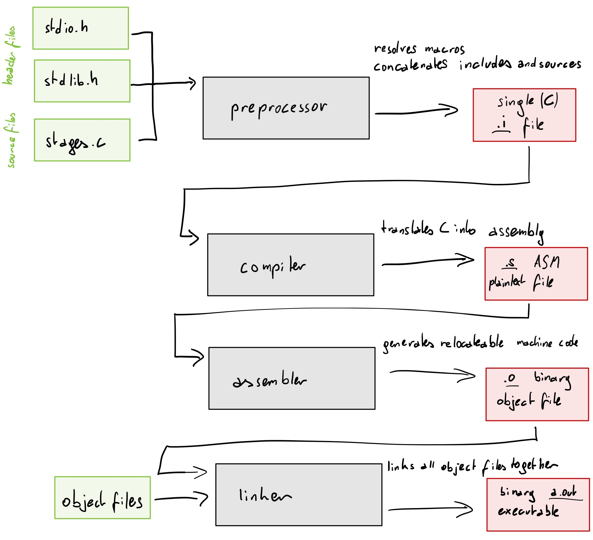

# basics
<!-- vim-markdown-toc GFM -->

* [computer architectures](#computer-architectures)
  * [Von Neumann](#von-neumann)
  * [Harvard](#harvard)
* [memory](#memory)
  * [virtual memory](#virtual-memory)
  * [memory layout](#memory-layout)
  * [the stack](#the-stack)
* [stages of compilation](#stages-of-compilation)
  * [preprocessor](#preprocessor)
  * [compiler](#compiler)
  * [assembler](#assembler)
  * [linker](#linker)
* [instruction set architectures](#instruction-set-architectures)
  * [types](#types)
    * [CISC](#cisc)
    * [RISC](#risc)
  * [instruction sets](#instruction-sets)
    * [x86](#x86)
      * [AT&T and Intel syntax](#att-and-intel-syntax)
      * [x86_32](#x86_32)
      * [x86_64](#x86_64)
  * [ARM](#arm)
* [executable file formats](#executable-file-formats)
  * [ELF](#elf)
  * [Mach-O](#mach-o)
  * [PE](#pe)
* [binary analysis](#binary-analysis)
  * [static](#static)
  * [dynamic](#dynamic)
* [tools](#tools)
  * [GDB](#gdb)
  * [binutils](#binutils)
  * [Python 3](#python-3)
  * [Compiler Explorer](#compiler-explorer)
  * [binvis.io](#binvisio)
  * [dotfiles](#dotfiles)
* [exploits](#exploits)
* [sources and further reading](#sources-and-further-reading)

<!-- vim-markdown-toc -->

# computer architectures

## Von Neumann

## Harvard

# memory

## virtual memory

## memory layout

## the stack

# stages of compilation

See [[pracbin, p. 12ff]](#sources-and-further-reading).

Let's go through the stages of compilation step by step. We'll use the following example:

**stages.c**

```c
#include <stdio.h>
#include <stdlib.h>

#define FORMAT_STRING "%s"
#define MESSAGE "hello, world!\n"

void greet() {
  printf(FORMAT_STRING, MESSAGE);
}

int main(int argc, char** argv, char** envp)
{
  greet();
  return EXIT_SUCCESS;
}
```

* *note:* using a `main()` signature with `envp` does not conform to POSIX but is widely supported by Unix-like systems and mentioned as a common alternative in the C standard ([[C11, Annex J.5.1, p. 575]](#sources-and-further-reading))

**stages-of-compilation.jpg**

</img>

* produced filenames assume compilation with `gcc --save-temps stages.c`
  * on macOS gcc is llvm in disguise and will produce an additional `stages.bc` bitcode file

## preprocessor

## compiler

## assembler

## linker

# instruction set architectures

aka. ISA

## types

### CISC

### RISC

## instruction sets

### x86

See [[inteldev]](#sources-and-further-reading).

#### AT&T and Intel syntax

#### x86_32

aka. x86

#### x86_64

aka. x64

## ARM

# executable file formats

## ELF

## Mach-O

## PE

# binary analysis

See [[pracbin, p. 2f]](#sources-and-further-reading).

## static

Static analysis is the process of gaining information about a binary without running it.

*Pros*

* no need for a CPU with a fitting architecture
* no need for additional software to run the binary (Kernel, etc.)

*Cons*

* more difficult to reason about due to missing runtime state

## dynamic

Dynamic analysis on the other hand executes the binary.

*Pros*

* easier, due to additional information (runtime state)

*Cons*

* might miss some code paths

# tools

## GDB

[GDB](gdb)

## binutils

See [[binutils]](#sources-and-further-reading).

## Python 3

## Compiler Explorer

* generates and compares binaries with different compilers and settings
* [godbolt.org](https://godbolt.org/)

## binvis.io

* visual analysis of binary files
* [binvis.io](https://binvis.io/)

## dotfiles

[dotfiles](dotfiles)

# exploits

[exploits](exploits)

# sources and further reading

* [C11] ISO, & IEC. (2010). ISO/IEC 9899:201x, International Standard Programming languages — C, Committee Draft (N1570 ed.). ISO/IEC. Retrieved from http://www.open-std.org/jtc1/sc22/wg14/www/docs/n1570.pdf
* [binutils] GNU Binary Utilities Documentation. (2002). Retrieved from http://www.gnu.org/software/binutils/manual/
* [inteldev] Intel. (2011). Intel 64 and IA-32 Architectures Software Developer’s Manual Combined Volumes. System, 3(253665). https://doi.org/10.1109/MAHC.2010.22
* [pracbin] Andriesse, D., & Francisco, S. (2018). PRACTICAL BINARY ANALYSIS Build Your Own Linux Tools for Binary Instrumentation, Analysis, and Disassembly (2nd ed.). No Starch Press.
